<div align="center">

```
  __  __       ____               __    
 |  \/  |__  _ _\ \      / /__  _| |_  
 | |\/| / _` | '_ \ /\ / / _ \| '__| 
 |_|  |_|\__,_|_| |_\ V  /\__,_|_|    
         github profile v2.0
```

</div>

<div align="center">

### `vaib@github ~ $ ./contributions.sh`



<br>

### `vaib@github ~ $ whoami`

<table>
<tr>
<td></td>
<td></td>
</tr>
</table>

<br>

### `vaib@github ~ $ cat /etc/motd`

```
  Welcome to my corner of GitHub.

  I build things for iOS, web, and whatever
  catches my curiosity. Currently exploring
  AI/ML integrations and open source tools.

  If you see something interesting, let's talk.
```

<br>


</div>
